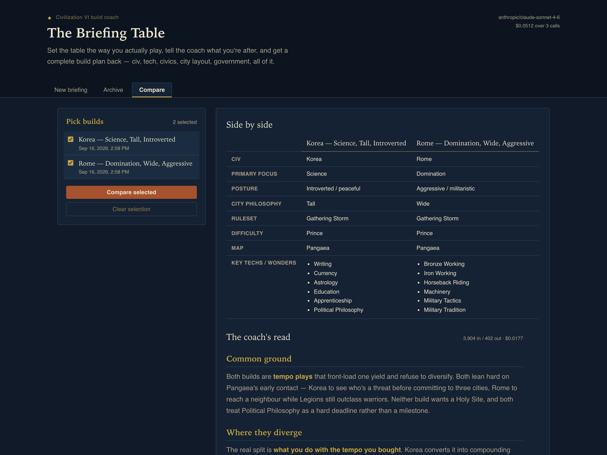

# Civ VI Strategy Coach

A local-first Civilization VI build coach. Set the table the way you actually play,
tell the coach what you're after, and get a complete build plan back — civ and leader,
tech path, civic path, city layout, government, dedications, and a Playbook you can
glance at mid-game. Every plan is saved to a SQLite file on your own machine, browsable
in an archive, and comparable side-by-side against past builds.

You run it yourself, with your own LLM API key. No hosted instance, no accounts.

> **Unofficial fan tool — not affiliated with, endorsed by, or connected to Firaxis
> Games or 2K.** Civilization VI and all related marks belong to their owners.

## Screenshots

| New briefing | Archive | Compare |
| --- | --- | --- |
|  |  |  |

## Setup

You need **Python 3.10+** and **Node 18+** (Node is only used to build the frontend once).

```bash
git clone https://github.com/trashgordon/civ6-strategy-coach.git
cd civ6-strategy-coach
cp .env.example .env        # then put your API key in it
```

Install the Python dependencies with whatever you like — [uv](https://docs.astral.sh/uv/)
is quickest:

```bash
uv venv && uv pip install -e .
```

<details>
<summary>…or plain pip / venv</summary>

```bash
python -m venv .venv
source .venv/bin/activate      # Windows: .venv\Scripts\activate
pip install -e .
```
</details>

Then start it:

```bash
python -m backend.run
```

That builds the frontend the first time (running `npm install && npm run build` for you),
starts the server on <http://localhost:8000>, and opens your browser. Later starts skip
the build and come up immediately; pass `--rebuild` after you pull frontend changes.

## Bring your own key

Model selection goes through [LiteLLM](https://docs.litellm.ai/), so any provider it
supports works. Set `MODEL` in your `.env` plus whichever API key matches:

```ini
# Anthropic
MODEL=anthropic/claude-sonnet-4-6
ANTHROPIC_API_KEY=sk-ant-...

# OpenAI
MODEL=openai/gpt-5
OPENAI_API_KEY=sk-...

# Google
MODEL=gemini/gemini-2.5-pro
GEMINI_API_KEY=...

# Fully local, no key needed (ollama serve must be running)
MODEL=ollama/llama3.1
```

> **A caveat, plainly stated:** the system prompt was tuned against Claude's
> instruction-following. Other providers should work — the call is provider-agnostic —
> but they haven't been tightly verified, especially the 8-section structure and the word
> limit. Contributions testing against other models are very welcome.

## Configuration

All of it optional except the model and its key.

| Variable | Default | What it does |
| --- | --- | --- |
| `MODEL` | `anthropic/claude-sonnet-4-6` | LiteLLM model string |
| *provider key* | — | e.g. `ANTHROPIC_API_KEY`, `OPENAI_API_KEY` |
| `DB_PATH` | `./data/strategies.db` | Where your saved builds live |
| `APP_PASSWORD` | unset | Set it to turn on a password gate (see below) |
| `HOST` | `127.0.0.1` | Bind address |
| `PORT` | `8000` | Port |

### Your data

Saved builds go in one SQLite file, `./data/strategies.db` by default. `data/` and `.env`
are both gitignored, so a fork can't accidentally publish your API key or your builds.
Back it up by copying that one file.

Schema changes are applied at startup from `PRAGMA user_version`, so `git pull`-ing an
update keeps your existing builds — no migration commands to run.

### Token usage and cost

Every model call is logged to an `api_calls` table with its token counts and estimated
dollar cost — build generations and compare calls alike. You'll see:

- the running total in the header, e.g. `$0.0512 over 3 calls`
- per-call tokens and cost next to each plan in the Archive, and under the compare writeup
- the full breakdown at `GET /api/usage` (lifetime totals, split by call kind, plus the
  50 most recent calls)

Costs come from [LiteLLM's pricing map](https://github.com/BerriAI/litellm/blob/main/model_prices_and_context_window.json),
which covers a few thousand models, so the figure is an **estimate from list prices** —
it won't know about your discounts, and it can't see cache hits or batch pricing. A model
LiteLLM has no price for is still logged, with cost recorded as unknown rather than zero;
the running total then shows as `≥ $x` so it doesn't quietly under-report. Local models
(Ollama and friends) correctly come out as free.

Cost accounting never fails a request — if the price lookup breaks, you still get your
plan and the call is logged without a cost.

To total it up yourself:

```bash
sqlite3 data/strategies.db "SELECT kind, COUNT(*), ROUND(SUM(cost_usd), 4) FROM api_calls GROUP BY kind;"
```

### Password gate

There's no login by default, which is the right thing when it's just you on localhost.
If you expose the instance past localhost, set `APP_PASSWORD` and every request needs a
session cookie you get by entering that password. It's a lock on your own front door,
not a multi-user auth system — don't treat it as one, and put it behind HTTPS if it's
reachable from the internet.

## How it works

```
frontend/  React + Vite, built to static files
backend/   FastAPI — serves the API and those static files on one port
  prompts.py     both system prompts, verbatim from the brief
  llm.py         the single LiteLLM call
  db.py          SQLite + PRAGMA user_version migrations (saved_builds, api_calls)
```

The three tabs map to three endpoints: `POST /api/generate` (generate + auto-save),
`GET /api/builds` (archive, with search and filters), and `POST /api/compare` (the
side-by-side table plus a compare-and-contrast writeup from a second prompt).
`GET /api/usage` reports what all of it has cost.

## Development

```bash
python -m backend.run --reload     # API with auto-reload
cd frontend && npm run dev         # Vite dev server on :5173, proxying /api to :8000
pytest                             # backend tests (no API key needed — the LLM is stubbed)
```

## Contributing

Issues and PRs welcome. The feature backlog in `civ6-app-brief.md` is priority-ordered
if you're looking for somewhere to start — outcome tracking (win/loss, victory type,
turn count, and a stats view) is the next thing worth building.

If you change how the coach talks, change the prompts in `civ6-app-brief.md` and
`backend/prompts.py` together — they're meant to stay identical.

## License

MIT — see [LICENSE](LICENSE).
