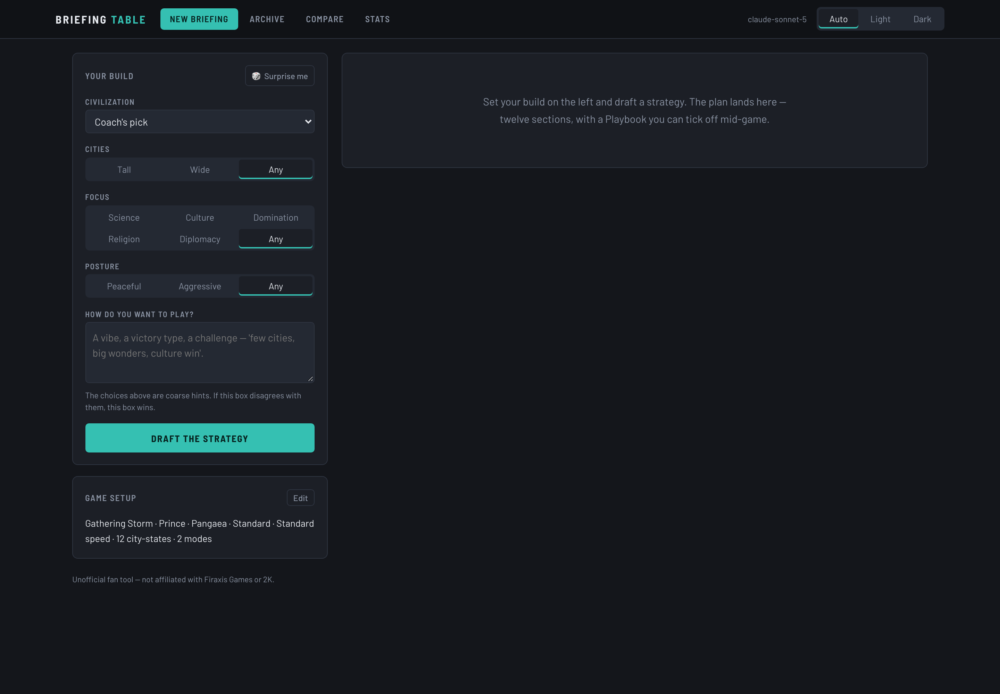
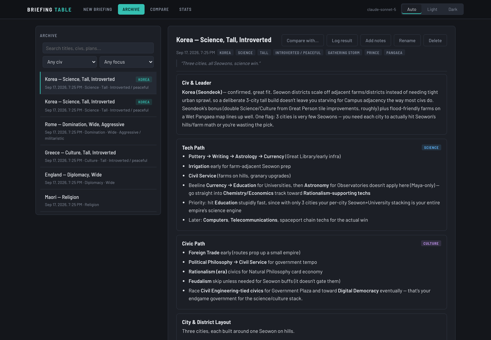
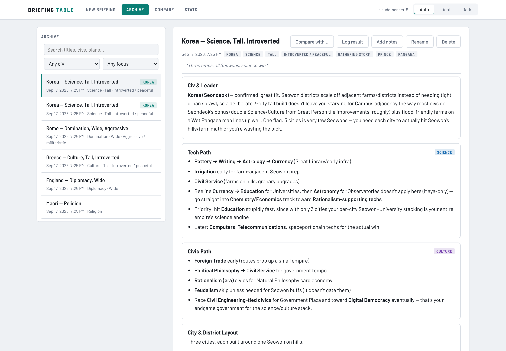

# Civ VI Strategy Coach

A local-first Civilization VI build coach. Set the table the way you actually play,
tell the coach what you're after, and get a complete build plan back — civ and leader,
tech path, civic path, city layout, government, dedications, and a Playbook you can
glance at mid-game. Every plan is saved to a SQLite file on your own machine, browsable
in an archive, and comparable side-by-side against past builds.

You run it yourself, with your own LLM API key. No hosted instance, no accounts.

> **Unofficial fan tool — not affiliated with, endorsed by, or connected to Firaxis
> Games or 2K.** Civilization VI and all related marks belong to their owners.

## Screenshots

| New briefing | A plan in the Archive | Light theme |
| --- | --- | --- |
|  |  |  |

Dark and light themes both ship. It follows your system setting until you pick one from
the **Auto / Light / Dark** switch in the top bar, and remembers the choice.

## Setup

You need **Python 3.10+** and **Node 18+** (Node is only used to build the frontend once).

```bash
git clone https://github.com/trashgordon/civ6-strategy-coach.git
cd civ6-strategy-coach
cp .env.example .env        # then put your API key in it
```

Install the Python dependencies with whatever you like — [uv](https://docs.astral.sh/uv/)
is quickest:

```bash
uv venv && uv pip install -e .
```

<details>
<summary>…or plain pip / venv</summary>

```bash
python -m venv .venv
source .venv/bin/activate      # Windows: .venv\Scripts\activate
pip install -e .
```
</details>

Then start it:

```bash
python -m backend.run
```

That builds the frontend the first time (running `npm install && npm run build` for you),
starts the server on <http://localhost:8000>, and opens your browser. Later starts skip
the build unless a pull changed the frontend source, in which case it rebuilds first
(`--rebuild` forces one).

## Bring your own key

Model selection goes through [LiteLLM](https://docs.litellm.ai/), so any provider it
supports works. Set `MODEL` in your `.env` plus whichever API key matches:

```ini
# Anthropic
MODEL=anthropic/claude-sonnet-5
ANTHROPIC_API_KEY=sk-ant-...

# OpenAI
MODEL=openai/gpt-5
OPENAI_API_KEY=sk-...

# Google
MODEL=gemini/gemini-2.5-pro
GEMINI_API_KEY=...

# Fully local, no key needed (ollama serve must be running)
MODEL=ollama/llama3.1
```

> **A caveat, plainly stated:** the system prompt was tuned against Claude's
> instruction-following. Other providers should work — the call is provider-agnostic —
> but they haven't been tightly verified, especially the thirteen-section structure and the
> word limit. `python -m evals.run` against another `MODEL` is the quickest way to check. Contributions testing against other models are very welcome.

## Configuration

All of it optional except the model and its key.

| Variable | Default | What it does |
| --- | --- | --- |
| `MODEL` | `anthropic/claude-sonnet-5` | LiteLLM model string |
| *provider key* | — | e.g. `ANTHROPIC_API_KEY`, `OPENAI_API_KEY` |
| `REASONING_EFFORT` | `low` | Reasoning depth on models that reason (see below) |
| `PROMPT_CACHE` | `1` | Cache the game-facts prompt prefix (see below) |
| `CIV6_PATH` | auto-detected | Your Civ VI install, for game-data grounding |
| `FACTS_PATH` | `./data/facts` | Where extracted game names are cached |
| `DB_PATH` | `./data/strategies.db` | Where your saved builds live |
| `APP_PASSWORD` | unset | Set it to turn on a password gate (see below) |
| `HOST` | `127.0.0.1` | Bind address |
| `PORT` | `8000` | Port |

### Grounding in your own game install (optional)

The coach recalls Civ VI from the model's training data, which means it can invent a
confident, plausible, non-existent name — a real plan here recommended the Golden Age
dedication "Exodus of the Evenkind", which isn't a thing.

If you own the game, you can ground it in the real thing:

```bash
python -m backend.extract_gamedata
```

That reads Firaxis's own gameplay XML and localization out of your install and caches
~2,300 canonical names (techs, civics, wonders, districts, policy cards, beliefs,
governors, governments, dedications and more) into `data/facts/`, plus all 52
city-states with their categories and full suzerain bonuses. It's auto-detected on
macOS, Windows and Linux Steam installs; set `CIV6_PATH` if not found.

Two things then happen:

- **Prevention** — the real names go into the prompt *with what they actually do*, so
  the coach reads the effect rather than recalling it. This matters more than the names:
  the coach repeatedly recommended "Corvée for wide infrastructure/settlers" when Corvée
  is +15% production toward ancient and classical wonders. The name was real, which is
  why nothing flagged it. With the effect in front of it, the coach stops citing the
  card for the wrong job.
- **Detection** — every name the coach puts in bold is checked against the data
  afterwards, and anything unrecognised is flagged above the plan with a ⚠ marker. Free.

#### The tech and civic trees

A real name can still be in the wrong place. The extractor also rebuilds each ruleset's
tech and civic trees — Vanilla, Rise & Fall and Gathering Storm separately, applying
each expansion's changes in the game's own load order, because Gathering Storm rewrites
prerequisites (Cartography needs Buttress, not Shipbuilding). Every tech and civic comes
with its prerequisites and what it unlocks, including each civ's uniques.

The briefing's ruleset tree goes into the prompt, and the Tech Path and Civic Path are
checked against it afterwards for three mistakes the name check can't see:

- **Out of order** — "Pottery → Currency → Writing", when Currency needs Writing.
- **Wrong tree** — Civil Service (a civic) in the tech path.
- **Wrong unlock** — "**Civil Service** for Classical Republic", which comes from
  Political Philosophy; "**Mathematics → Construction** for Colosseum", a civic unlock.

Before this, 16 of the 18 plans in one real archive had at least one of these. The check
leans towards staying quiet: "Economics for Commercial Hub snowball" isn't flagged
(hubs keep paying off, and you have Currency by then), nor is "for Seowon buffs".

#### Prompt caching

The facts block is byte-identical on every call for a given ruleset (one cache entry
per ruleset, three at most), so it's sent as a cached prefix — the
volatile part (your configuration) sits after the breakpoint and never invalidates it.
Measured on Claude Sonnet 5 with the full grounding block (~35,800 cached tokens):

| | cost |
| --- | --- |
| First plan (writes the cache) | $0.116 |
| Next plan within the window | **$0.030** |

Cache reads are a tenth the price of fresh input, writes are 1.25×, and the grounded
prompt is about 36,000 tokens of which ~35,800 is the cacheable prefix. So caching is
doing heavy lifting here: **generate a few plans in one sitting and all but the first
cost a third of the cold price.** A single isolated plan pays the write premium instead.
Set `PROMPT_CACHE=0` to turn it off, and the header tooltip reports how many tokens have
been served from cache.

If the cold price bothers you, don't trim the block to fix it: civ abilities and policy
cards are half of it, and they're exactly where the misattributions happened. Filtering
abilities down to the chosen civ looks tempting but makes things worse — the block would
change with every civ, turning each change into a cold write of the whole prefix. A
longer cache TTL is the lever that actually helps.

**The extracted data is never committed.** Those names are Firaxis/2K's copyrighted
content, so this repo ships the extractor, not the output — `data/` is gitignored, and
everyone runs it against the copy of the game they own. That also means the names match
whichever DLC and patch *you* have.

Skip all of this and the app works exactly as before: no grounding, no flags, no extra
tokens. Nothing here is required.

### Reasoning models

Current reasoning models (Claude Sonnet 5 and Opus 5, OpenAI o-series, Gemini thinking
models) spend output tokens on internal reasoning *before* writing any of the answer.
Left unbounded, reasoning eats the entire token budget and you get an empty plan.

`REASONING_EFFORT` defaults to `low`, which is right for this app — the coach's brief is
deliberately short, not a proof. Measured on Claude Sonnet 5: a full plan
comes to about 2,900–3,200 output tokens. Raise it to `medium` or `high` if you want
more deliberation and are happy to pay for it. Models that don't reason ignore it.

If a plan ever comes back empty, the error names the cause and the knob to turn rather
than just shrugging.

### Your data

Saved builds go in one SQLite file, `./data/strategies.db` by default. `data/` and `.env`
are both gitignored, so a fork can't accidentally publish your API key or your builds.
Back it up by copying that one file.

Schema changes are applied at startup from `PRAGMA user_version`, so `git pull`-ing an
update keeps your existing builds — no migration commands to run.

### Token usage and cost

Every model call is logged to an `api_calls` table with its token counts and estimated
dollar cost — build generations and compare calls alike. You'll see:

- the running total in the header, e.g. `$0.0512 over 3 calls`
- per-call tokens and cost next to each plan in the Archive, and under the compare writeup
- the full breakdown at `GET /api/usage` (lifetime totals, split by call kind, plus the
  50 most recent calls)

Costs come from [LiteLLM's pricing map](https://github.com/BerriAI/litellm/blob/main/model_prices_and_context_window.json),
which covers a few thousand models, so the figure is an **estimate from list prices** —
it won't know about your discounts, and it can't see cache hits or batch pricing. A model
LiteLLM has no price for is still logged, with cost recorded as unknown rather than zero;
the running total then shows as `≥ $x` so it doesn't quietly under-report. Local models
(Ollama and friends) correctly come out as free.

Cost accounting never fails a request — if the price lookup breaks, you still get your
plan and the call is logged without a cost.

To total it up yourself:

```bash
sqlite3 data/strategies.db "SELECT kind, COUNT(*), ROUND(SUM(cost_usd), 4) FROM api_calls GROUP BY kind;"
```

### Password gate

There's no login by default, which is the right thing when it's just you on localhost.
If you expose the instance past localhost, set `APP_PASSWORD` and every request needs a
session cookie you get by entering that password. It's a lock on your own front door,
not a multi-user auth system — don't treat it as one, and put it behind HTTPS if it's
reachable from the internet.

## How it works

```
frontend/  React + Vite, built to static files
backend/   FastAPI — serves the API and those static files on one port
  prompts.py     both system prompts, verbatim from the brief
  llm.py         the single LiteLLM call
  db.py          SQLite + PRAGMA user_version migrations (saved_builds, api_calls)
```

The three tabs map to three endpoints: `POST /api/generate` (generate + auto-save),
`GET /api/builds` (archive, with search and filters), and `POST /api/compare` (the
side-by-side table plus a compare-and-contrast writeup from a second prompt).
`GET /api/usage` reports what all of it has cost, `GET /api/stats` reports what actually
won, and `PATCH /api/builds/{id}` renames a build, edits its campaign journal, or records
how the game went.

A plan has thirteen sections. Five of them exist because the first version of this
app didn't have them and the plans were worse for it:

- **City-States & Envoys** — which specific city-states to chase and what their
  suzerain bonus does for this build, grounded in the extracted data
- **Timing Benchmarks** — checkable milestones by turn, pitched to the configured
  game speed, and the margin that means you're off-pace
- **Governors** — which governors, in which cities, and which promotions to spend
  titles on. Promotions are injected grouped under the governor who owns them, because
  a flat list left the coach hedging ("the promotion that boosts Great Person points"
  rather than naming Grants)
- **What Goes Wrong** — the two or three ways this particular build loses, the early
  warning sign for each, and the pivot
- **Wonders** — two to four wonders to race for, where each goes, when to start it, a
  backup for when an AI finishes it first, and one to skip. Each wonder's real effect and
  placement rule is injected from the game data, so "Petra if you have desert" is the
  game's rule rather than the coach's memory

The City-States section leans on the extracted data: without it the coach can only say
"send envoys for suzerain bonuses", which isn't advice.

### Outcome tracking

A plan is only advice until you know whether it worked. Open a build in the Archive,
**Log result** — won, lost or abandoned, the victory type, the turn it ended — and the
**Stats** tab turns the archive into a record: win rate overall and broken down by civ,
focus, city philosophy, posture, map and difficulty, plus victories by type and your
average winning turn. When you leave the civ to the coach, its pick counts as the civ
you played.

To see the Stats view with something in it before you've logged any games:

```bash
python -m backend.demo_data                          # 40 invented builds in data/demo.db
DB_PATH=./data/demo.db PORT=8001 python -m backend.run
```

That's a separate database on a separate port, so your real archive is untouched — the
script refuses to write into the database the app is configured to use.

Every rate is shown next to the record it came from (`3–1 (75%)`, not `75%`), and under
five decided games the view says so. With a handful of games a bare percentage invites
reading a trend into a coin flip.

Smaller things worth knowing: **🎲 Surprise me** rolls a civ and all three style
dropdowns (never "No preference" — a randomiser that shrugs isn't a surprise),
**Compare with…** in the archive jumps to the Compare tab with that build already
ticked, and every saved build has a **campaign journal** for notes as the game actually
plays out.

## Evals

Every prompt change used to be checked by generating a plan or two and reading them.
`evals/` replaces that with a number:

```bash
python -m evals.run --dry-run     # the briefs, and roughly what a run costs
python -m evals.run               # run them (asks before spending, ~$0.30)
python -m evals.run --rescore     # re-apply changed scoring to the last run, free
```

It sends six fixed briefs (`evals/briefs.json`) through exactly the path the app uses —
each chosen because it once produced a specific error — and scores every plan with
deterministic checks: all thirteen headers verbatim, within the word cap, 5–8 Playbook
steps, turn numbers in the benchmarks, real city-states and governor promotions named,
dedications covering Normal and Dark ages, no unverified names, and none of the
**known-wrong claims** the coach has been caught making before (Corvée as a settler card,
Research Agreements, the Physics tech, Ballista…). A suite check confirms Marathon
benchmarks actually scale against Standard ones.

No model grades another model: every check is a rule you could apply by hand, so a
score means the same thing next week. Expected headers and the word cap are read from
the live prompt, so the eval can't drift from what it's checking. Each run is saved
under `data/evals/` and compared against the last one, with a note of what changed —
model, prompt, grounding, or briefs.

When the coach gets caught in a new mistake, add it to `KNOWN_WRONG` in
`evals/scoring.py`. That's how a fix stays fixed.

The first cold call warms the prompt cache before the rest run in parallel, and spend
is logged to your usage totals as `eval`.

## Development

```bash
python -m backend.run --reload     # API with auto-reload
cd frontend && npm run dev         # Vite dev server on :5173, proxying /api to :8000
pytest                             # backend tests (no API key needed — the LLM is stubbed)
```

## Contributing

Issues and PRs welcome. The feature backlog in `civ6-app-brief.md` is priority-ordered
if you're looking for somewhere to start — outcome tracking (win/loss, victory type,
turn count, and a stats view) is the next thing worth building, and it's what turns the
archive from a record into a feedback loop.

One gap worth naming: there are no JavaScript tests. The backend has 95; the markdown
renderer is verified by hand in a browser.

If you change how the coach talks, change the prompts in `civ6-app-brief.md` and
`backend/prompts.py` together — they're meant to stay identical.

## License

MIT — see [LICENSE](LICENSE).
